# Курсовой проект
<i>Тема: Продажа железнодорожных билетов</i>

<<<<<<< HEAD
---

### Описание предметной области

=======
>>>>>>> 10f779e2640ad82b6420adf4523fdd20d7f73866
### USE-Case

### ERD Диаграмма

<<<<<<< HEAD

---
### Приложение

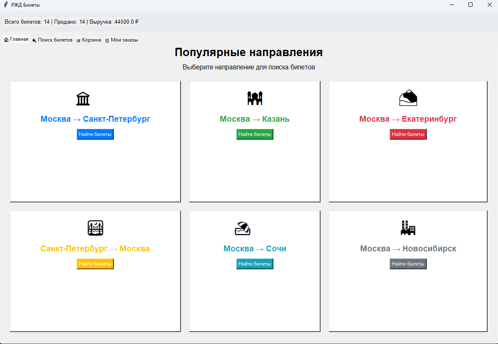

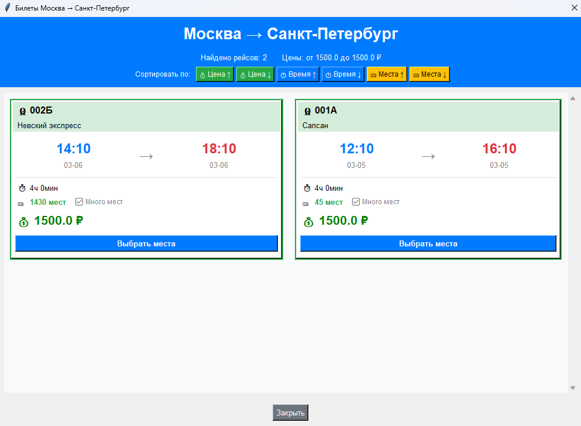

Пример работы сортировки (в данном случае по возрастанию количества мест) и условной раскраски по количеству доступных мест

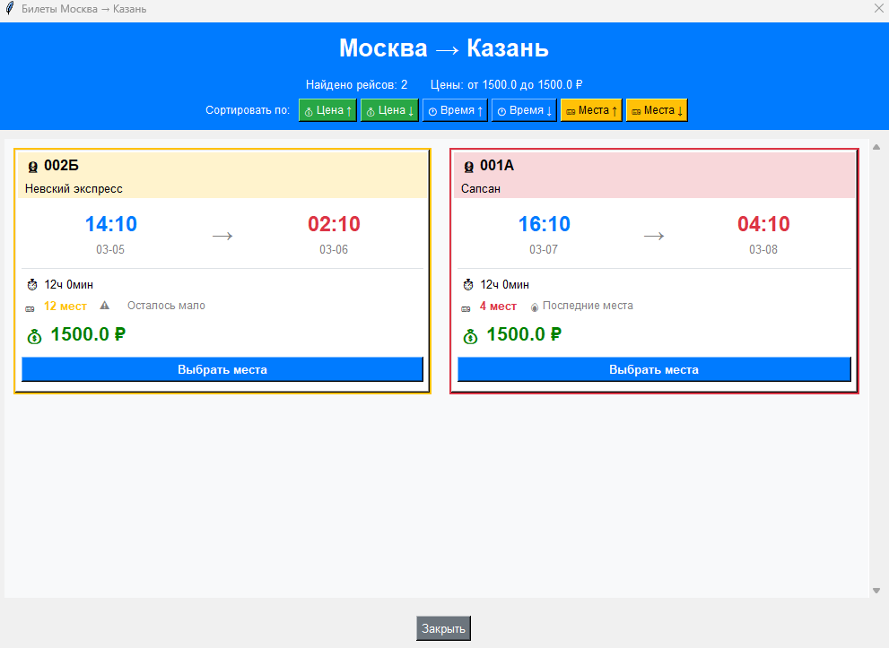

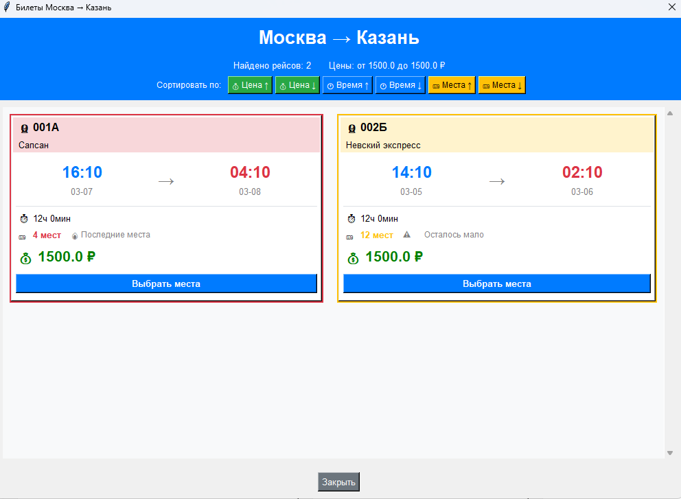

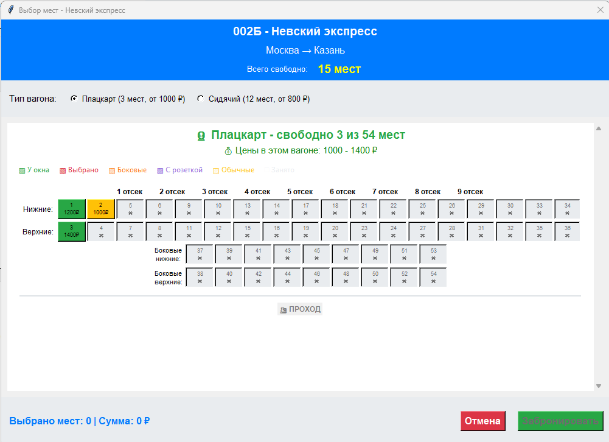

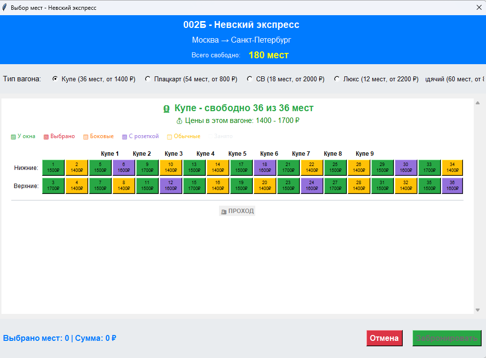

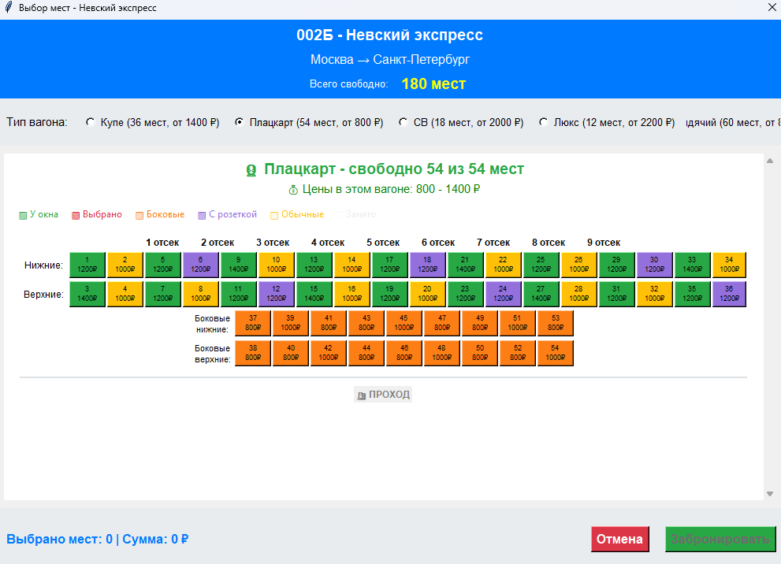

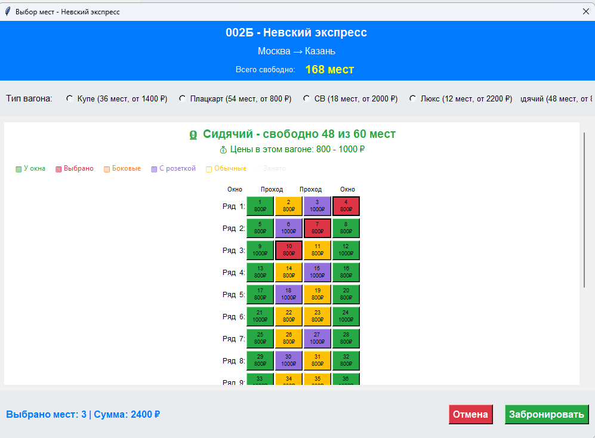

Поиск

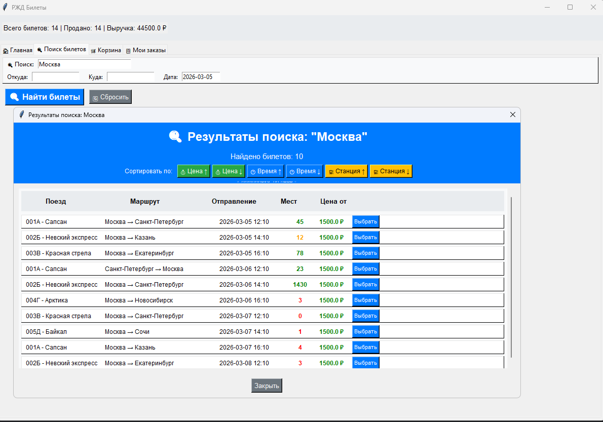 

#### Администрирование

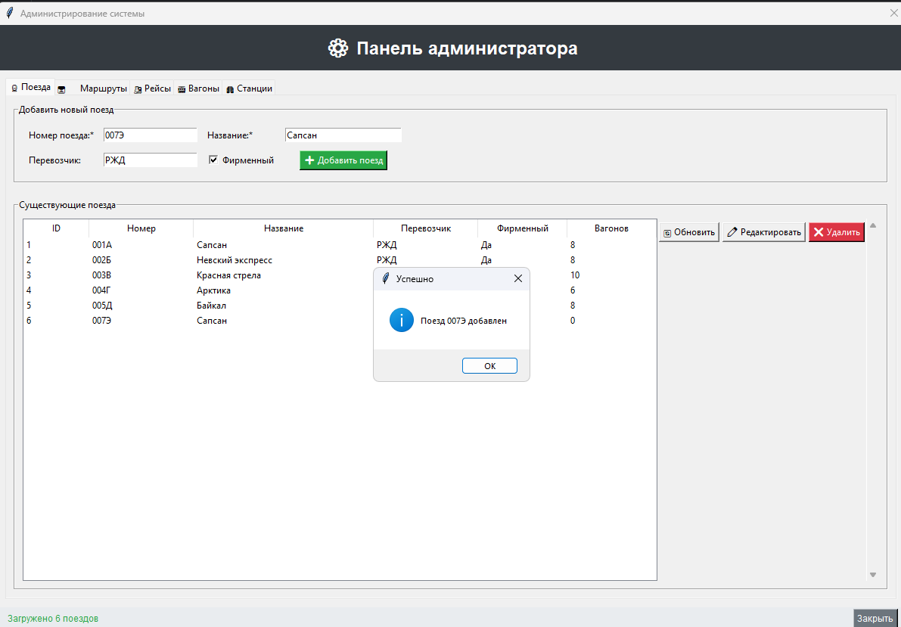

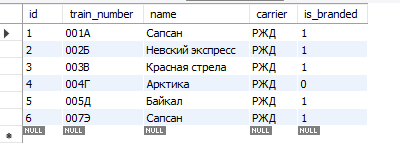

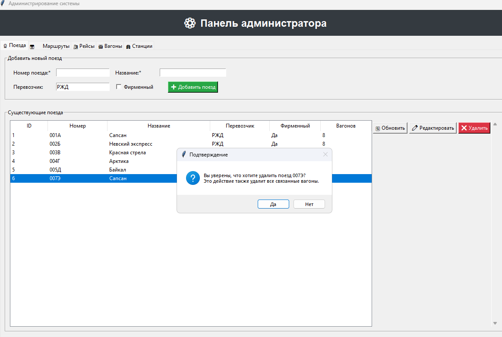

### API 

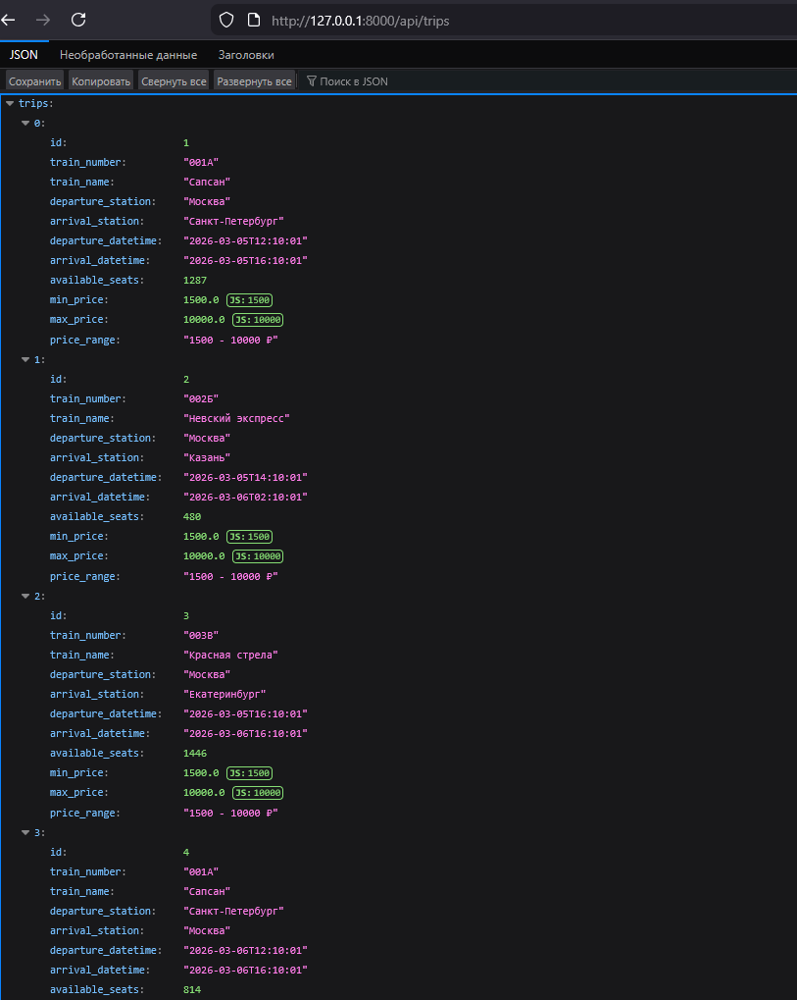

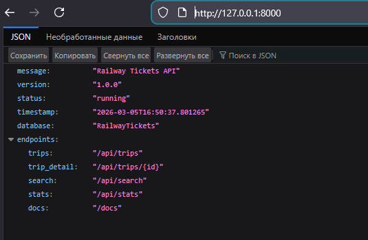

### Тесты

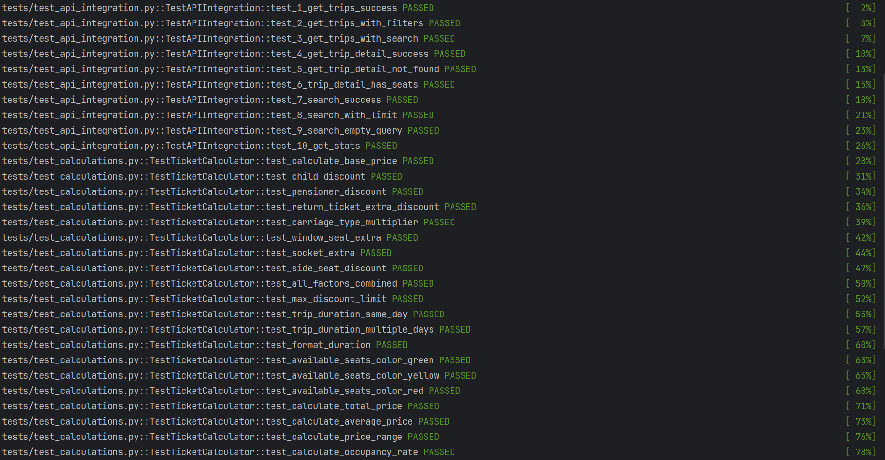

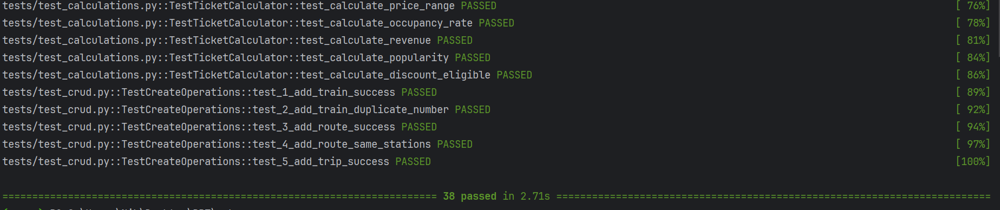
=======

>>>>>>> 10f779e2640ad82b6420adf4523fdd20d7f73866
